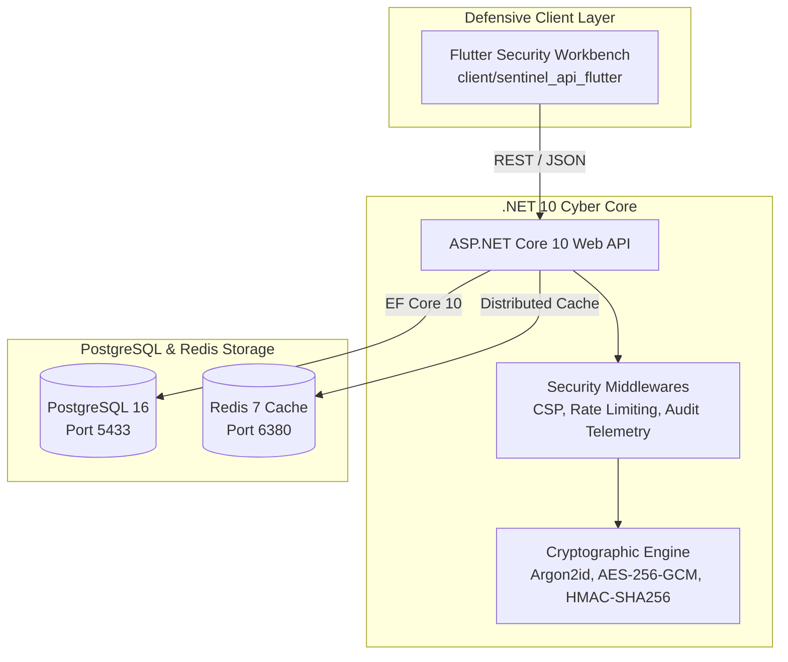

# 🛡️ API Security Lab — Defensive Cyber Workbench (.NET 10)

An enterprise-grade **Cyber Security & Defensive API Lab** engineered with **ASP.NET Core 10 (.NET 10)**, **PostgreSQL**, **Redis**, and a cross-platform **Flutter Defensive Operations Workbench**.

Designed to demonstrate production-grade implementation of **OWASP API Security Top 10** controls, advanced cryptographic primitives, field-level encryption, and real-time security audit telemetry.

---

## 🔒 Cyber Security Controls Implemented

| Security Control | Technology / Algorithm | Defensive Implementation |
| :--- | :--- | :--- |
| **Password Hashing** | Argon2id v13 (`m=65536, t=3, p=1`) | Cryptographically secure random salts per user, memory-hard hashing resistant to GPU/ASIC cracking. |
| **Field Encryption** | AES-256-GCM | Authenticated Galois/Counter Mode encryption for sensitive PII fields (SSN, credit cards) stored in PostgreSQL. |
| **Authentication** | JWT Bearer Tokens & Refresh Tokens | HMAC-SHA256 signed access tokens with token revocation and database refresh token rotation. |
| **SQL Injection Defense** | EF Core 10 Parameterized Queries | Prevention of SQLi payload execution (`admin' OR '1'='1`) via parameterized SQL bindings & Linq expression trees. |
| **XSS Sanitization** | Ganss HtmlSanitizer | Automatic stripping of dangerous `<script>` vectors, `onerror=` handlers, and malicious JavaScript URIs. |
| **Rate Limiting** | Redis Sliding Window | Distributed rate limiting returning HTTP 429 Too Many Requests to prevent API abuse and DDoS attacks. |
| **Audit Telemetry** | Structured Security Logging | Intercepts all requests to record Client IP, HTTP Status, Requested Endpoint, and Threat Risk Levels. |

---

## 🏗️ Architecture Stack



---

## 🚀 Quick Start with Docker

### Prerequisites
* Docker Desktop & Docker Compose

### Launch Containers
```powershell
docker compose up -d --build
```

Access Services:
* **API Security Server**: `http://localhost:5265`
* **PostgreSQL Database**: `localhost:5433` (`Database=sentinel_db`, `Username=secuser`, `Password=SecLabPass2026!`)
* **Redis Security Cache**: `localhost:6380`

---

## 💙 Flutter Security Workbench

The project includes a full **Flutter (Dart)** client application located in `client/sentinel_api_flutter`.

To run the Flutter app natively:
```powershell
cd client/sentinel_api_flutter
flutter run -d chrome
```

---

## 🧪 Automated Security Test Suite

Run xUnit security tests to verify cryptographic invariants:
```powershell
dotnet test tests/SentinelApi.Tests/SentinelApi.Tests.csproj
```
